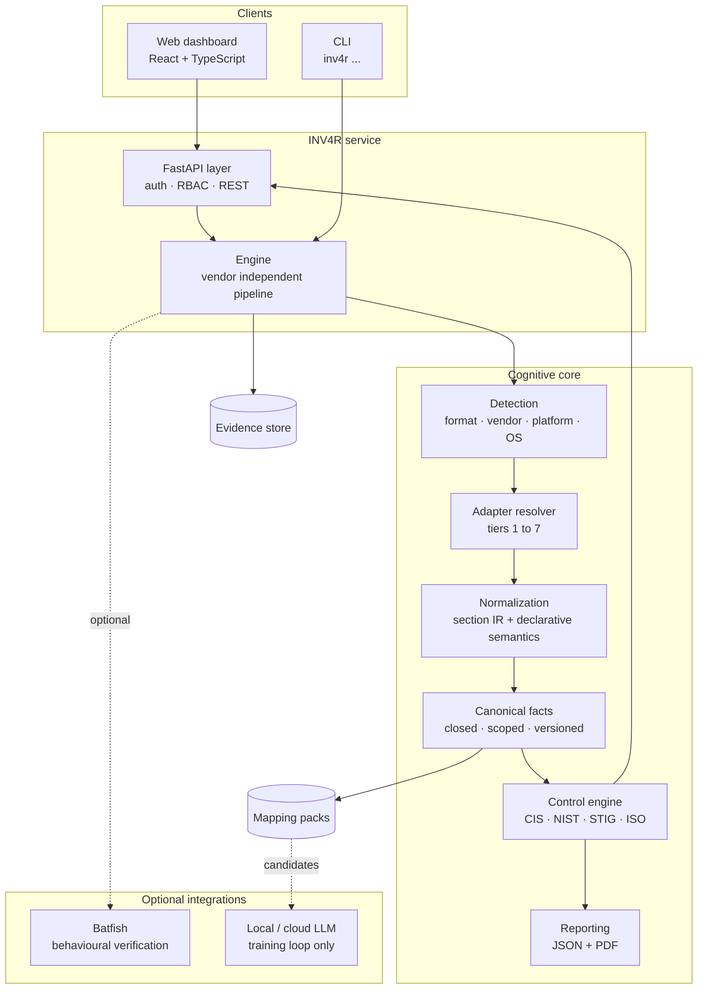
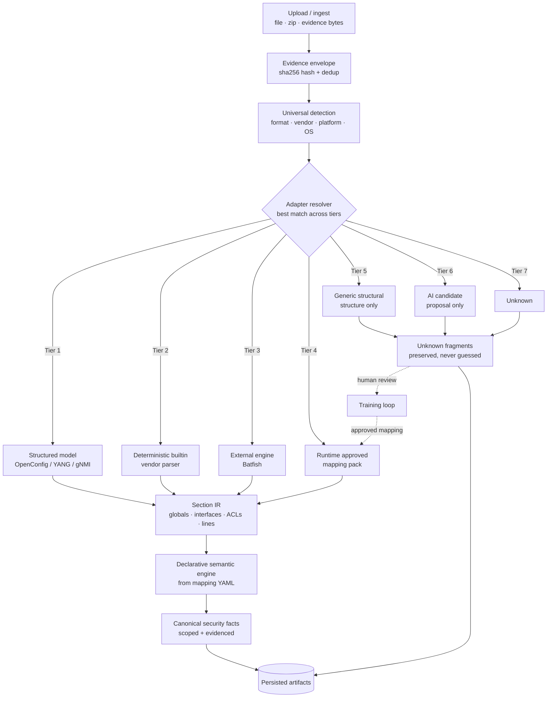
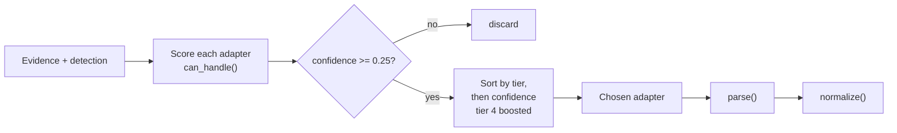
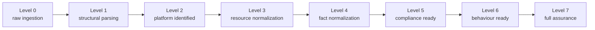
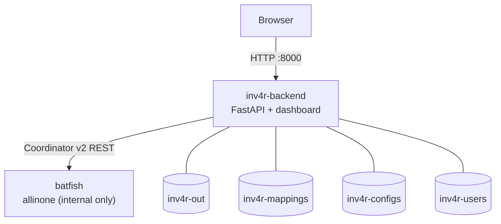
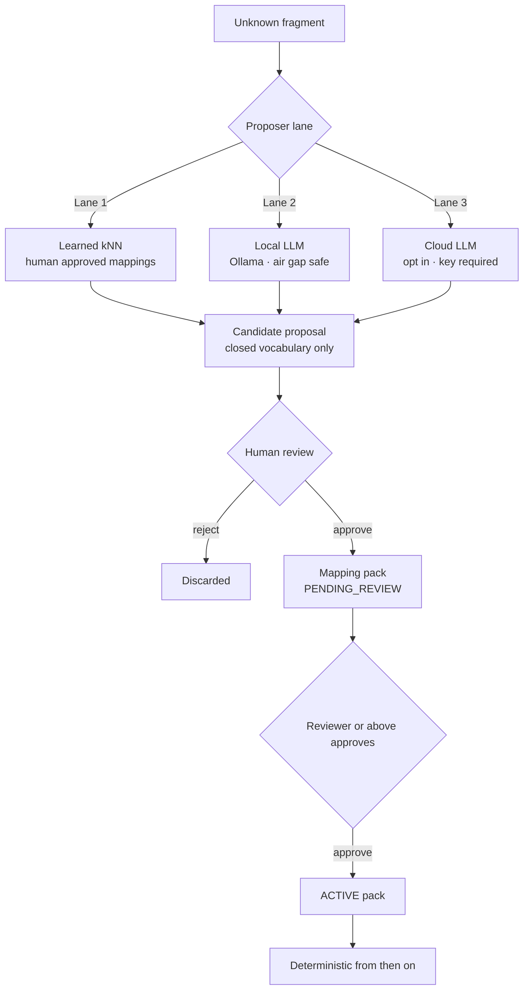

# INV4R

[](https://www.python.org/)
[](LICENSE)
[](tests/)
[](dashboard/)

A vendor agnostic compliance engine for network device configurations, with AI
assistance where it is safe to use it. It covers firewalls, routers, switches,
and cloud security groups, and evaluates them against **CIS**, **NIST 800-53**,
**DISA STIG**, and **ISO 27001** control baselines.

INV4R turns heterogeneous, vendor specific configuration into one canonical,
evidenced security fact model, then scores it against compliance frameworks.
The core is independent of any vendor. Vendor knowledge lives in versioned
adapters, profiles, and mapping packs, never in the engine.

---

## Table of contents

- [Why INV4R](#why-inv4r)
- [Architecture](#architecture)
- [Pipeline](#pipeline)
- [Adapter tiers](#adapter-tiers)
- [Supported vendors](#supported-vendors)
- [Coverage levels](#coverage-levels)
- [Canonical vocabulary](#canonical-vocabulary)
- [Quickstart](#quickstart)
- [Docker & web dashboard](#docker--web-dashboard)
- [Dashboard workflow](#dashboard-workflow)
- [AI lanes & the training loop](#ai-lanes--the-training-loop)
- [HTTP API](#http-api)
- [Configuration](#configuration)
- [Testing](#testing)
- [Project layout](#project-layout)
- [Documentation](#documentation)
- [License](#license)

---

## Why INV4R

| Challenge | INV4R's answer |
|-----------|----------------|
| Every vendor speaks a different dialect | An adapter driven resolver across seven tiers, from structured models down to generic structure |
| Compliance findings must be auditable | Every fact cites the exact config line and rule that produced it |
| Unknown syntax must never be guessed | Unmapped input is preserved as `UNKNOWN` and routed to a human review loop |
| Hard coded parsers go stale | Vendor knowledge lives in versioned profiles, grammars, and mapping packs |
| A model must not silently change verdicts | AI only proposes, humans approve, and compliance is computed deterministically |

> INV4R is a universal, adapter driven normalization platform. It does **not**
> claim to natively understand every vendor syntax. Unrecognized input is
> structurally parsed and preserved, marked `UNKNOWN`, and routed to the human
> mapping workflow.

---

## Architecture



The full architecture, including the deployment topology, module map, and
state diagrams, is documented in [docs/ARCHITECTURE.md](docs/ARCHITECTURE.md).

---

## Pipeline

The primary path is **deterministic and rule based**, so no AI or LLM call sits
on it. AI lanes exist only for syntax that the deterministic adapters cannot
map.



---

## Adapter tiers

The resolver scores every adapter and selects the lowest tier that has
sufficient confidence. Runtime mappings approved by a human (tier 4) receive a
deliberate boost, so learned knowledge wins over generic structure.



| Tier | Adapter class | Meaning |
|------|--------------|---------|
| 1 | `structured_model` | OpenConfig / YANG / gNMI / NETCONF / RESTCONF payloads |
| 2 | `deterministic_builtin` | Shipped vendor parsers (Cisco IOS, Juniper, Palo Alto, Fortinet, Arista, SONiC, AWS SG) |
| 3 | `external_engine` | Batfish or another modeling engine |
| 4 | `runtime_approved` | Mapping packs created in the training UI and approved by a human |
| 5 | `generic_structural` | Parses the structure of unfamiliar syntax only, so semantics stay `UNKNOWN` |
| 6 | `ai_candidate` | AI proposes mappings from the closed vocabulary, and a human approves them |
| 7 | `unknown` | No safe interpretation |

---

## Supported vendors

INV4R is built to be vendor agnostic. The engine itself never changes when a
new vendor shows up. Supporting one means adding vendor knowledge as data and
adapters, such as a profile, a template, or a mapping pack, and the same
pipeline, canonical facts, and controls apply straight away. The vendors
covered today are listed below.

| Coverage | Vendors |
|----------|---------|
| **Structured models** | OpenConfig / YANG shaped JSON |
| **Native INV4R adapters** | Cisco IOS, Juniper Junos, Fortinet, Palo Alto, Arista EOS, SONiC, AWS Security Groups |
| **Batfish backed expansion** | A10, Arista, AWS, Azure, Cisco, Check Point, Cumulus, F5, Fortinet, Juniper, Palo Alto, SONiC |

Anything outside these lists is not rejected. It is parsed structurally,
preserved as `UNKNOWN`, and sent to the human mapping workflow, so a new vendor
can be taught through the training loop without touching the engine.

---

## Coverage levels



The report always states the achieved level for each device. For example, an
unknown vendor is reported as *"Level 1: structural parsing, security status
UNKNOWN"*, and never as compliant.

---

## Canonical vocabulary

The security fact vocabulary is **closed and versioned**. New facts require the
human schema governance path, and AI mappings are restricted to this list.
Anything unrecognized is stored as `vendor_extension` with `status = UNKNOWN`.

```text
management.ssh.enabled            management.ssh.version
management.ssh.acl.present        management.telnet.enabled
management.http.enabled           management.https.enabled
management.session_timeout        management.acl.present
authentication.aaa.enabled        authentication.password.hashing
logging.remote.enabled            logging.local.enabled
network.route.present             network.interface.present
acl.present                       acl.default_action
snmp.v1.v2c.enabled               snmp.v3.enabled
firewall.policy.present           vendor_extension
```

---

## Quickstart

```bash
python3 -m venv .venv
source .venv/bin/activate
pip install -e ".[pdf,dev]"

inv4r ingest configs/                             # detect + parse all devices
inv4r assess configs/ --framework cis --out out/  # evaluate against CIS
inv4r report out/ --format pdf --out out/report.pdf
inv4r ai --eval                                   # quantitative AI benchmark
inv4r train <config>                              # interactive mapping session
inv4r serve-api --host 127.0.0.1 --port 8000      # backend + dashboard
```

---

## Docker & web dashboard

```bash
export INV4R_JWT_SECRET="$(openssl rand -hex 32)"
export INV4R_SECRET_KEY="$(openssl rand -hex 32)"
export INV4R_BOOTSTRAP_ADMIN_EMAIL="admin@example.com"
export INV4R_BOOTSTRAP_ADMIN_PASSWORD="use-a-long-unique-password"
docker compose up -d --build
```

`INV4R_SECRET_KEY` encrypts cloud LLM API keys at rest and must differ from
`INV4R_JWT_SECRET`. It only becomes mandatory once a cloud API
key is stored.

Open the dashboard at **[http://localhost:8000](http://localhost:8000)**.
Batfish is intentionally internal to the Docker network and exposes no host
ports.



---

## Dashboard workflow

Core workflow:

- **New audit**: pick the policy and the controls to evaluate, then drop the
  files. While the upload runs, you can watch which AI recognition lane is
  active. Detection, normalization, and the assessment all happen on upload.
- **Control Results**: one row per control, showing `Control · Title ·
  Severity · Result` plus an **Evidence** action. The full detail lives behind
  that action.
- **Evidence & Remediation**: the only detailed view. It shows the raw
  configuration with the exact evidence lines highlighted, next to an
  explanation a person can read. A vendor specific configuration block appears
  only when validated policy data defines one for the detected platform.
- **Knowledge & learning**: unknown structures are preserved and grouped per
  uploaded configuration. A decision writes a `PENDING_REVIEW` mapping pack,
  which shows a provisional result until a Reviewer approves it.
- **Reports**: PDFs for each device and for the whole fleet, with device
  identity, findings, evidence, and remediation sourced from policy.

Only the selected frameworks and controls are evaluated. An unselected
framework is never scored, counted, or shown. Each result carries the framework
that produced it, so the Compliance Overview reports `PASSED` / `FAILED` /
`UNKNOWN` for each selected framework as explicitly labelled counts.

**Deterministic verdicts, provisional previews.** PASS, FAIL, and UNKNOWN come
from the control engine alone, and AI lanes only propose and never change a
verdict. Training a mapping writes a `PENDING_REVIEW` pack that the
authoritative engine ignores, so the dashboard shows a *provisional* result
(`preview=true`) next to the real one until a Reviewer promotes the pack.
Approving it resets the engine caches, and the authoritative result updates on
the next request, with no rerun needed.

### The training queue

The queue is keyed by content, so one decision resolves a raw line everywhere it
occurs. It is presented **per uploaded configuration**, with a separate *Shared
across configurations* section, and it defaults to the current session so a
fresh session starts with its own list.

### Unknowns are resolved before a report exists

Reports are generated only after every unresolved finding that affects the
selected report scope has been reviewed. Unknown lines are listed in the queue
for **that configuration**, and every decision re-evaluates the audit
automatically. The PDF stays locked until no unresolved line remains for the
nodes the report covers.

---

## AI lanes & the training loop

The proposer is a chain of lanes, with provenance recorded on every suggestion.
The air gap switch is enforced in code, not by convention.

| Lane | What it is | Network | Requires |
|------|-----------|---------|----------|
| `learned` *(default)* | TF-IDF plus cosine kNN, trained on your approved mappings | none | nothing |
| `local_llm` | learned plus an Ollama or OpenAI compatible server on loopback | localhost only | Ollama running |
| `cloud_llm` | learned plus a hosted API | yes | `air_gapped: false` **and** an API key |
| `auto` | learned when air gapped, cloud when a key exists | depends on the lane chosen | nothing |



Invariants that hold in **every** lane:

- The closed vocabulary is enforced on all proposals, so a model cannot invent facts.
- Nothing applies automatically. Every proposal stays `PENDING` until a human approves it.
- Compliance verdicts are computed only from approved deterministic packs.
- Every proposal records which lane produced it (`suggested_by`) for audit.

So the AI can be wrong and the system stays correct.

---

## HTTP API

A typed FastAPI service (`inv4r/api/`) wraps the engine and exposes parsing,
assessment, review, and reporting over REST, with authentication and role based
access control.

```bash
inv4r serve-api --host 127.0.0.1 --port 8000
# or: python -m uvicorn inv4r.api:create_app --factory --port 8000
```

---

## Configuration

Runtime configuration comes from environment variables and the AI settings:

| Setting | Purpose |
|---------|---------|
| `INV4R_JWT_SECRET` | Signs authentication tokens |
| `INV4R_SECRET_KEY` | Encrypts cloud LLM API keys at rest. It must differ from `INV4R_JWT_SECRET` and is only required once a cloud key is stored |
| `INV4R_BOOTSTRAP_ADMIN_EMAIL` / `INV4R_BOOTSTRAP_ADMIN_PASSWORD` | Credentials for the first admin account |
| `air_gapped` | When `true`, cloud lanes are blocked. Set it to `false` to allow `cloud_llm` |

---

## Testing

```bash
python -m pytest tests/ -q          # full suite
python -m pytest tests/test_api.py -q
cd dashboard && npm run lint        # dashboard typecheck (tsc --noEmit)
```

The suite covers the pipeline, the API, control evaluation, policy selection
(`tests/test_policy_selection.py`), sessions, review dedup, and the regression
guards that keep the dashboard honest about empty states.

---

## Project layout

```text
inv4r/
  core/        envelope, canonical model, facts, coverage, section IR, semantics
  detection/   format + vendor detection (data driven signatures)
  adapters/    base, resolver, generic parser, tier 2 parsers, runtime mappings
  mapping/     proposals, decisions, registry (runtime approved mappings)
  controls/    framework loader + evaluator + deterministic remediation narrative
  reporting/   JSON assessment + PDF report
  training/    interactive mapping session
  ai/          candidate mapping proposer lanes
  behaviour/   Batfish behavioural verification
  api/         FastAPI service
  cli.py       ingest / assess / report / train / ai / serve-api / vocabulary / adapters
profiles/      declarative vendor profiles
mappings/      runtime approved mapping packs (created via the training loop)
controls/      CIS, NIST, STIG, ISO control profiles (YAML)
               _impact_shared.yaml  fact to plain language impact catalog
               <profile>__user.yaml Control overlay added by an admin (skipped as a profile)
configs/       sample device configurations
out/           runtime artifacts (gitignored, recreated at boot)
dashboard/     React + TypeScript web dashboard
tests/         pytest suite (pipeline, API, controls, regression guards)
docs/          architecture and decision records
```

---

## Documentation

| Document | Contents |
|---|---|
| [docs/ARCHITECTURE.md](docs/ARCHITECTURE.md) | Component, pipeline, training loop, and deployment diagrams |

---

## License

Released under the [MIT License](LICENSE).