# INV4R Architecture

INV4R normalizes heterogeneous network configuration into a single, auditable
security fact model, then evaluates that model against compliance frameworks.
The core is independent of any vendor. All vendor knowledge lives in versioned
adapters, profiles, and mapping packs.

---

## 1. System overview

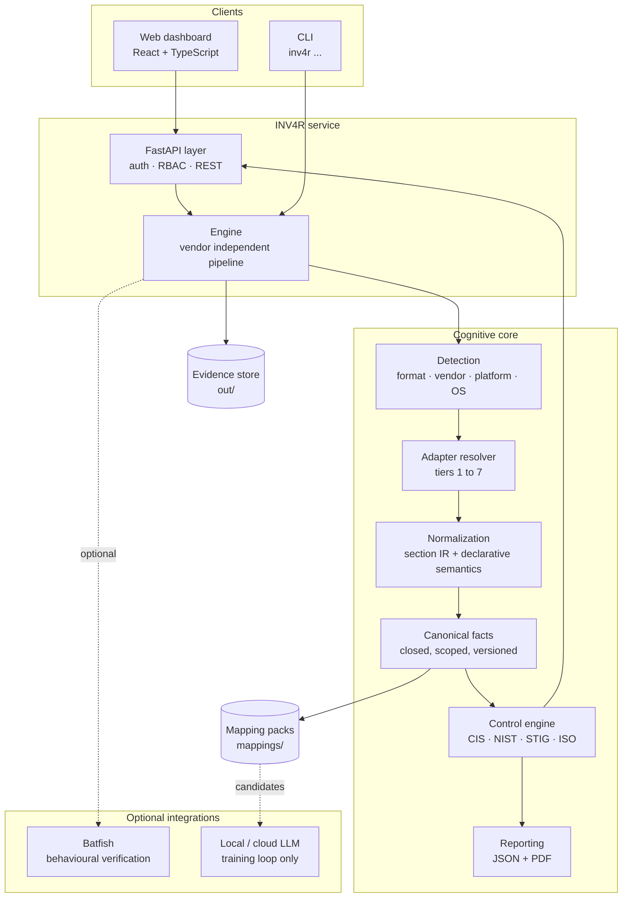

---

## 2. Ingestion and normalization pipeline

Every byte of evidence takes the same path: hash, detect, resolve, parse,
normalize, then persist. Normalization is **deterministic** for known vendors,
and the AI lanes only ever touch syntax that no adapter understands.

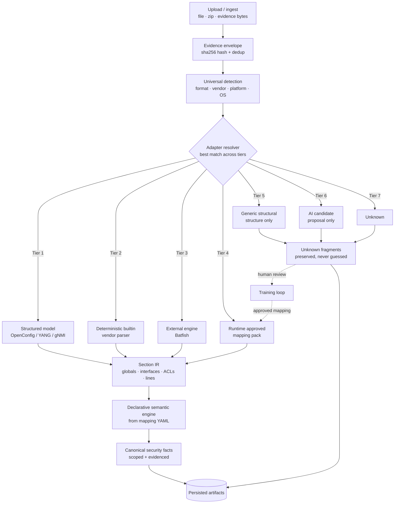

---

## 3. Adapter tier resolution

The resolver scores every adapter and picks the lowest tier that has sufficient
confidence. A runtime mapping approved by a human (tier 4) gets a deliberate
boost, so learned knowledge wins over generic structure.

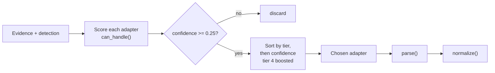

| Tier | Adapter | Meaning |
|------|---------|---------|
| 1 | `structured_model` | OpenConfig / YANG / gNMI / NETCONF / RESTCONF |
| 2 | `deterministic_builtin` | Shipped vendor parsers (Cisco, Juniper, PAN-OS, Fortinet, Arista, SONiC, AWS SG) |
| 3 | `external_engine` | Batfish or another modeling engine |
| 4 | `runtime_approved` | Mapping packs from the training loop, approved by a human |
| 5 | `generic_structural` | Parses structure only, so semantics stay `UNKNOWN` |
| 6 | `ai_candidate` | AI proposes mappings from the closed vocabulary, and a human approves them |
| 7 | `unknown` | No safe interpretation |

---

## 4. Coverage model

Each device is placed on a coverage ladder. The report always states the level
actually achieved, so an unparsed vendor is never presented as compliant.

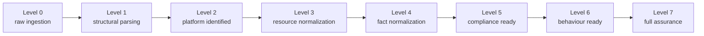

---

## 5. Training loop with a human in the loop

Unknown fragments are the only input to the AI lanes. A lane produces a
*candidate*, and only an explicit human decision turns it into a deterministic
mapping. The loop cannot create an `ACTIVE` pack on its own.

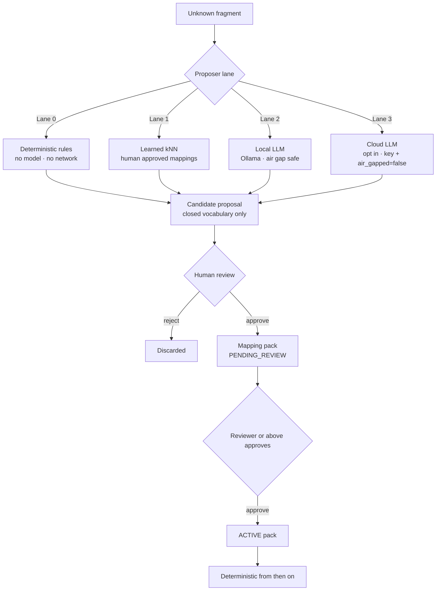

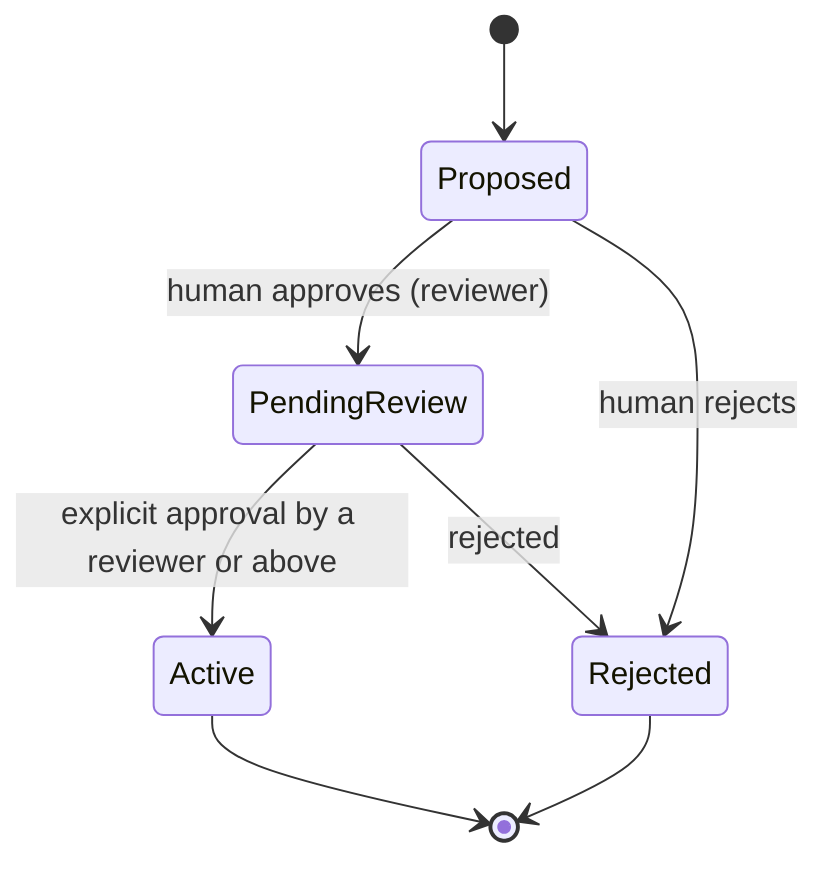

---

## 6. Assessment and reporting

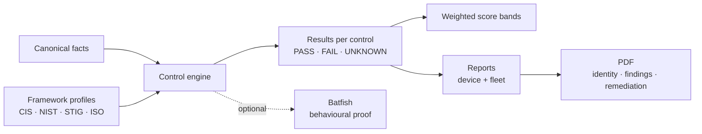

---

## 7. Policy selection, evidence, and the preview lifecycle

The dashboard holds **one** policy selection, made up of the selected framework
ids, an optional control subset per framework, and the assessment scope. It
sends that selection to every evaluation endpoint. The server evaluates only
that selection, and every `ControlResult` carries the `framework` that produced
it, so aggregate counts are grouped per framework without a second evaluation.

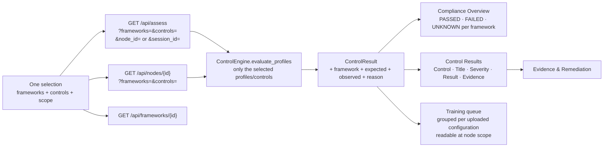

### Unknowns are resolved before a report exists

An audit that leaves unknown lines is **unresolved**, not finished. The audit
flow reads the queue at *node scope* (`/api/review/queue?node_id=…`), so only
the configuration that was just ingested is listed, and everything else is a
`backlog` that cannot block it. The PDF stays locked until that node's queue is
clear. The backend refuses with `409` (`_require_review_clear`), and the UI only
mirrors the rule. Each decision re-evaluates the node in place, so the final
results appear without re-running the audit.

The chart on the dashboard follows the same grouping for each framework: **one
bar per selected framework, with three columns (Pass / Fail / Unknown)** on a
shared axis, and never a bucket for each control id.

### Evidence & Remediation

The `Evidence` action opens the only detailed view for a control result. It has
two panels: the **raw configuration with the exact evidence lines highlighted**
(red for FAIL, amber for UNKNOWN, green for PASS) and a **remediation** panel
written for people to read.

The left panel shows the ingested bytes, and nothing is reformatted or
re-serialized. The right panel is composed in this order:

| Block | Source |
|---|---|
| WHAT IS WRONG | The control's `observed` state, derived from the evaluated facts |
| WHY IT MATTERS | `controls/_impact_shared.yaml` (fact to impact) plus the control's `rationale` |
| WHAT SHOULD CHANGE | The control's `expected` state |
| SUGGESTED CONFIGURATION | `remediation_cli_sequence` from the control's policy data, **only** for the detected platform |

The vendor block is shown only when validated policy data defines it
(`has_remediation`). An `UNKNOWN` result never shows one, because nothing is
guessed before the mapping has been trained.

### Authoritative vs provisional results

Training does not change a verdict. A decision writes a `PENDING_REVIEW`
mapping pack, which the authoritative engine ignores. A second engine that
replays those packs (`preview=true`) predicts the outcome instead. Promoting the
pack to `ACTIVE` resets both engines, so the authoritative result updates
immediately and the operator never has to re-run the workflow.

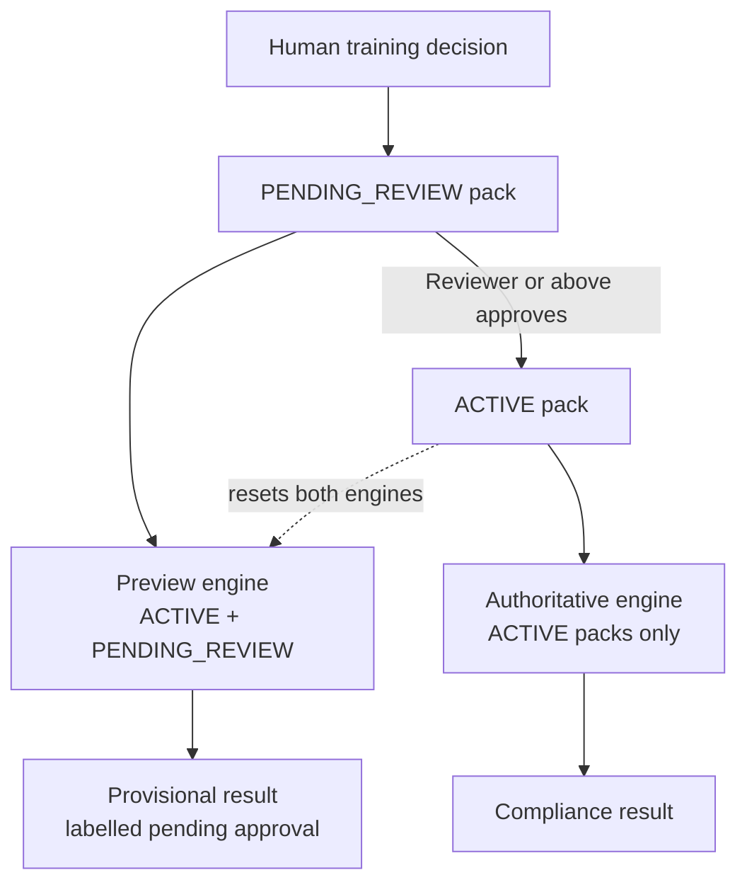

Learning closes the loop. A decision re-evaluates the affected configurations,
refreshes the aggregates for each selected framework, and updates the
Compliance Overview without any further interaction.

---

## 8. Normalization is documented, not surfaced as a UI

The Normalization Schema panel and the Remediation Simulation panel were
removed. Normalization itself is unchanged and lives here:

- §2 pipeline: detection, resolver, section IR, declarative semantics, then facts
- §3 adapter tiers: which tier owns which kind of input
- §4 coverage model: the level actually achieved, always stated
- `GET /api/vocabulary`: the closed, versioned fact vocabulary as data

---

## 9. Deployment topology

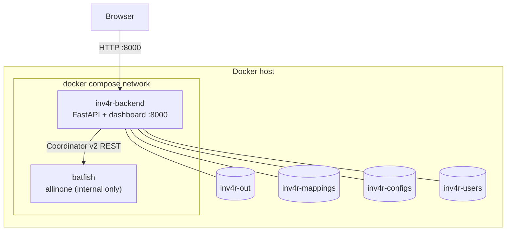

---

## 10. Module map

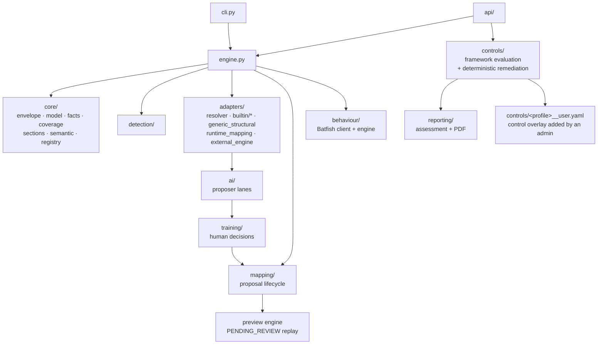